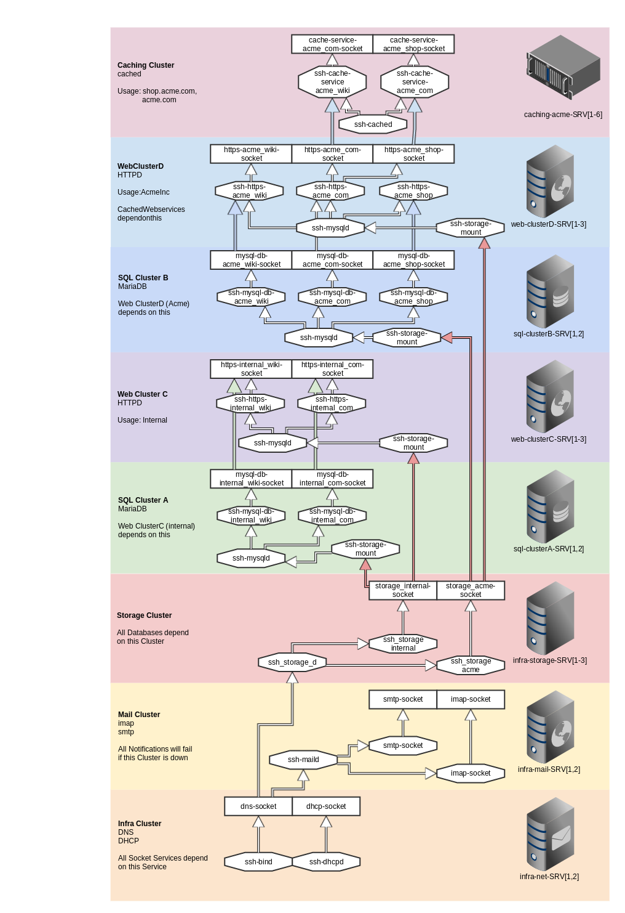
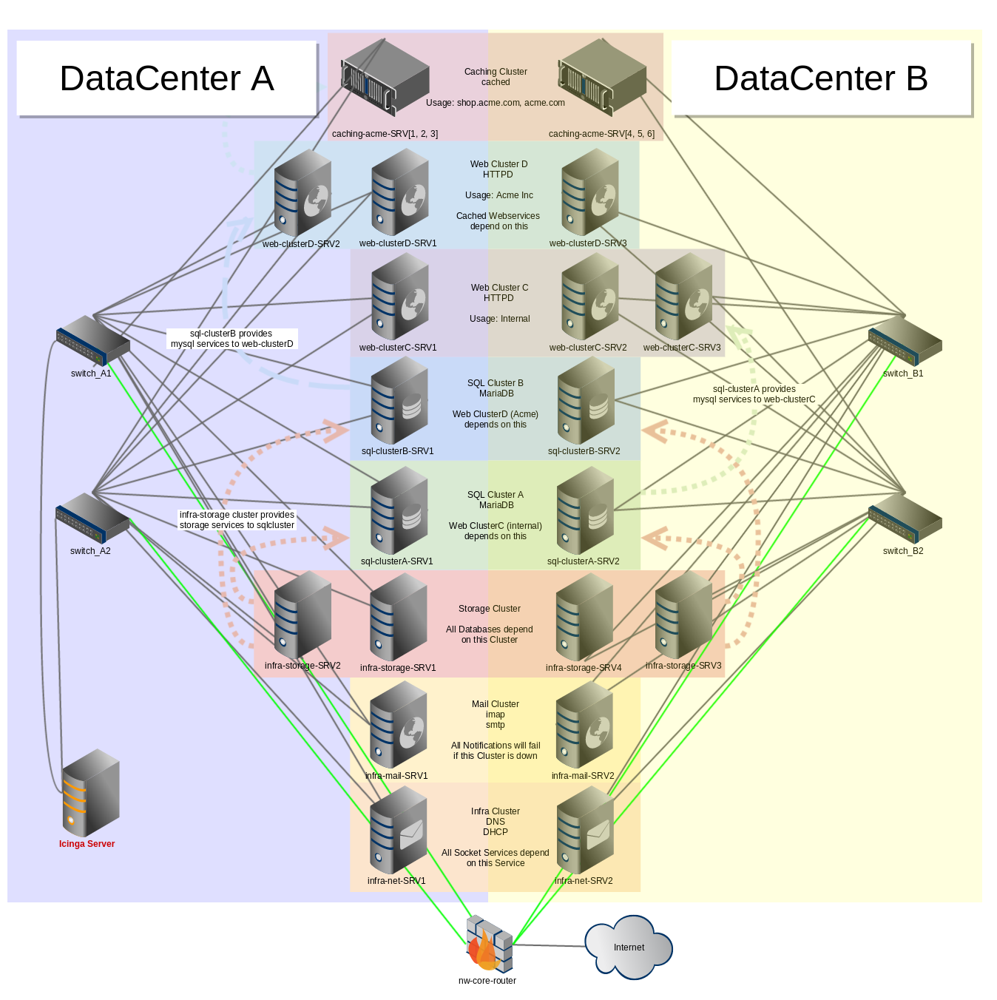

# icinga2-demo
demo config with fully simulated hosts and services

## Introduction

This demo simulates hosts and services with in a whole environment. All host and service checks are based on the dummy check_command but are extended with a little bit more magic.
It calculates the exit value of each check by the following aspects:

## icinga2

### Install

- copy icinga2-demo.d to /etc/icinga2.conf
- add to /etc/icinga2/icinga2.conf
```
include_recursive "icinga2-demo.d"
```
- if not using the example configuration provided by the icinga2 project be sure to keep or move your api-users


### Simulated Environment

Manipulate service's and host's status by using the web frontend (disable active checking) OR by setting problem periods inside checksets.conf or host_inventory.conf.

####Hosts:
- is the core router reachable?
- is one of the switches reachable?
  - this contains full path checking, from the icinga2 server's point of view.
- is this host in a special offline period?

####Services:
- is the parent host online?
- is there a dependency of another service
  - for example a database service depends on it's mounted storage and the storage cannot be mounted if the storage service running on the storage cluster is offline
- is this service in a special offline period?

The scenario contains dependencies, notification rules, users and groups of all kinds.

####Users:
- Different Usergroups/Roles
  - one user per group
- User "Data_DB"
  - notifications about Database issues during daytime
- User "Walter_Web"
  - notifications about web related issues during daytime
- User "Andy_Infra"
  - notifications about infrastructure related issues during daytime
- User "Vladev_Nightguy"
  - Severe Problems during nighttime
- User "Coyote_Customer"
  - Severe Problems on Acme Systems and Services all day

####Overview




## Nagvis & Business Process
